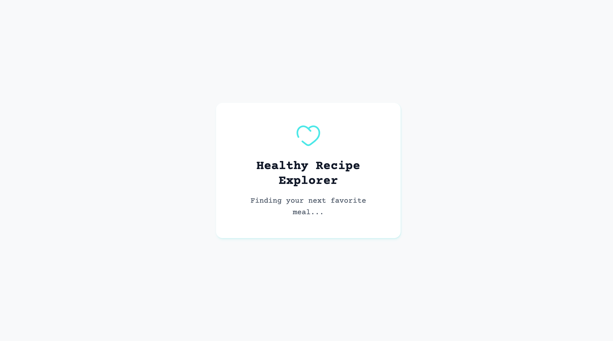

# 🥗 Healthy Recipe Explorer

A modern **React (Next.js)** web app for discovering healthy and vegetarian recipes.  
Built to practice clean architecture, state management, performance optimization, and delightful UI animations.



---

## ✨ Features

- 🔍 **Search Recipes** by keyword (e.g., “pasta”, “salad”, “chicken”)
- 📄 **Recipe Details** with ingredients, steps, and source link
- 🌗 **Dark / Light Mode** with smooth transitions
- 💾 **Favorites Tab** (saved in localStorage)

---

## 🧱 Tech Stack

- **Next.js** (React + TypeScript)
- **Tailwind CSS** (Responsive UI)
- **Zustand** (State Management)
- **Framer Motion** (Animations)
- **TheMealDB API** (Recipe Data)
- **Vercel** (Deployment)

---

## 🗂️ Project Structure

```
src/
├── app/ # Pages & layouts
├── components/ # UI components
├── store/ # Zustand store
├── hooks/ # Custom hooks
├── services/ # API calls
├── types/ # TypeScript types
└── styles/ # Animations, global styles
```

---

## 🚀 Getting Started

### 1. Clone repo

```bash
git clone https://github.com/mohamedyasser27/healthy-recipe-explorer.git
```

### 2. install bun

```bash
# mac 
curl -fsSL https://bun.sh/install | bash

# windows
powershell -c "irm bun.sh/install.ps1 | iex"
```

### 2. Install dependencies

```bash
bun install
```

### 3. Run locally

```bash
bun run dev
Visit http://localhost:3000
```
